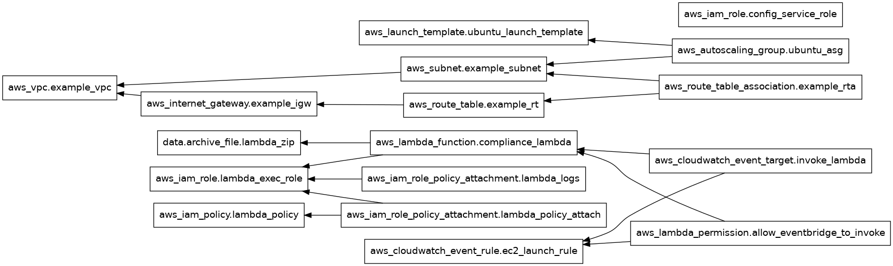

# Mitigating the Confused Deputy Problem in AWS Auto Scaling Groups

Andy Rea, 25/03/2024

## Executive Summary

This report outlines a proof of concept (PoC) developed to address a specific instance of the confused deputy problem within AWS Auto Scaling Groups (ASGs). This vulnerability arises when an ASG is configured to use a launch template that can be modified to specify an unapproved AMI, potentially allowing the deployment of unauthorised or malicious software within an organization's cloud environment. This solution leverages AWS Lambda, CloudWatch Events, and Security Hub to prevent the launch of EC2 instances from public AMIs not approved by organizational policies.

This POC uses the rule that an AMI is not permitted if it is public but this is only for the purposes of demonstration, other rules could be used in its place.


## Technical Architecture and Solution Overview

The PoC employs a multi-faceted approach to monitor and react to EC2 instance launches that utilize unauthorised AMIs (i.e. for this POC, those which are public). The core components of this solution include:

1. **CloudWatch Event Rule**: Monitors for `RunInstances` API calls, triggering on the launch of EC2 instances.

```hcl
resource "aws_cloudwatch_event_rule" "ec2_launch_rule" {
  name        = "ec2-instance-launch-rule"
  description = "Triggers on EC2 instance launch"

  event_pattern = jsonencode({
    "source" : ["aws.ec2"],
    "detail-type" : ["AWS API Call via CloudTrail"],
    "detail" : {
      "eventSource" : ["ec2.amazonaws.com"],
      "eventName" : ["RunInstances"]
    }
  })
}
```

2. **Lambda Function**: Invoked by the CloudWatch event, it evaluates whether the launched instance uses a private AMI. If a public AMI is detected, the function executes a series of corrective actions:
    - Suspends the associated ASG (if applicable) to prevent further instance launches.
    - Terminates the non-compliant instance.
    - Submits a custom finding to AWS Security Hub using the ASFF, documenting the unauthorised launch attempt.

```python
def lambda_handler(event, context):
    # Initialize EC2 client
    ec2_client = boto3.client('ec2')
    autoscaling_client = boto3.client('autoscaling')

    event_time = event['detail']['eventTime']
    account = event['account']
    region = event['region']

    # # Extract the invoking resource details from the AWS Config event
    for item in event['detail']['responseElements']['instancesSet']['items']:
        instance_id = item['instanceId']
        ami_id = item['imageId']
        tags = item['tagSet']['items']

        asg_name = None
        for tag in tags:
            if tag['key'] == 'aws:autoscaling:groupName':
                asg_name = tag['value']
                break

        # Check if the AMI is private
        ami_info = ec2_client.describe_images(ImageIds=[ami_id])
        ami_public = ami_info['Images'][0]['Public']

        if ami_public:
            if asg_name:
                try:
                    autoscaling_client.suspend_processes(
                        AutoScalingGroupName=asg_name
                    )
                    print(f"Suspended ASG: {asg_name}")
                except Exception as e:
                    print(f"Error suspending ASG {asg_name}: {str(e)}")

            try:
                ec2_client.terminate_instances(InstanceIds=[instance_id])
                print(f"Terminating instance: {instance_id}")
            except Exception as e:
                print(f"Error terminating instance {instance_id}: {str(e)}")

            send_invalid_ami_event_to_security_hub(EventDetails(
                    timestamp=event_time,
                    instance_id=instance_id,
                    image_id=ami_id,
                    account_id=account,
                    region=region,
                    auto_scaling_group_name=asg_name
                ))

    return {
        'statusCode': 200,
        'body': json.dumps('Evaluation complete.')
    }
```

The code to submit the Security Hub findings using AWS Security Finding Format (ASFF) is below.  The relevant details are taken from the event like the timestamp.  For this POC, if an instance was associated with an Auto Scaling Group then the Auto Scaling Group Name was added to the 'Other' section of the findings details related to the EC2 Instance.  There might be a more relevant way but this did produce the relevant information when viewed Security Hub.

```python
def send_invalid_ami_event_to_security_hub(event_details: EventDetails):
   securityhub = boto3.client('securityhub')
   finding = {
      'SchemaVersion': '2018-10-08',
      'Id': event_details.instance_id + '/compliance-check',
      'ProductArn': f'arn:aws:securityhub:{event_details.region}:{event_details.account_id}:product/{event_details.account_id}/default',
      'GeneratorId': 'custom-compliance-check',
      'AwsAccountId': f'{event_details.account_id}',
      'Types': ['Software and Configuration Checks/Industry and Regulatory Standards'],
      'CreatedAt': f'{event_details.timestamp}',
      'UpdatedAt': f'{event_details.timestamp}',
      'Severity': {'Label': 'HIGH'},  # Adjusted from 'WARNING' to a valid value
      'Title': 'EC2 Instance Non-Compliance with Company Standards',
      'Description': f'EC2 instance {event_details.instance_id} with AMI {event_details.image_id} is non-compliant and was terminated.',
      'Resources': [
         {
            'Type': 'AwsEc2Instance',
            'Id': event_details.instance_id,
            'Partition': 'aws',
            'Region': f'{event_details.region}',
            'Details': {
               'AwsEc2Instance': {
                  'ImageId': event_details.image_id
               },
               'Other': {  # Add ASG information in the Other field
                  'AutoScalingGroupName': event_details.auto_scaling_group_name if event_details.auto_scaling_group_name else 'Not part of an ASG'
               }
            }
         }
      ],
      'Compliance': {'Status': 'FAILED'},  # This was correct
      'RecordState': 'ACTIVE'
   }

   response = securityhub.batch_import_findings(Findings=[finding])
   print(response)
   return response
```

3. **Custom Script for Triggering the Vulnerability**: Simulates an attempt to exploit the confused deputy problem by modifying the AMI ID in a launch template to point to the latest public AWS Linux v2 image.

```bash
#!/bin/bash
export AWS_PAGER=""

# Define variables
LT_NAME="$1"  # Launch template name from the first script argument
LT_VERSION='$Latest'  # Example: use specific version number, or adjust as needed

# Find the latest AWS Linux 2 AMI ID
AMI_ID=$(aws ec2 describe-images --owners amazon --filters \
    "Name=name,Values=amzn2-ami-hvm-*-x86_64-gp2" \
    "Name=state,Values=available" \
    --query 'Images | sort_by(@, &CreationDate) | [-1].ImageId' \
    --output text)

# Retrieve the full configuration of the specified source version of the launch template
LT_DATA=$(aws ec2 describe-launch-template-versions --launch-template-name "$LT_NAME" --versions "$LT_VERSION" --query "LaunchTemplateVersions[0].LaunchTemplateData" --output json)

# Update the AMI ID in the retrieved launch template data
UPDATED_LT_DATA=$(echo $LT_DATA | jq --arg AMI_ID "$AMI_ID" '. + {ImageId: $AMI_ID}')

# Create a new launch template version with the updated AMI ID, preserving other configurations
aws ec2 create-launch-template-version --launch-template-name "$LT_NAME" --source-version "$LT_VERSION" --version-description "Update with latest AWS Linux 2 AMI" --launch-template-data "$UPDATED_LT_DATA"

# Optional: Update the default version to the new version
# Get the latest version number of the launch template
NEW_VERSION=$(aws ec2 describe-launch-templates --launch-template-names "$LT_NAME" --query "LaunchTemplates[0].LatestVersionNumber" --output text)

# Update the default version
aws ec2 modify-launch-template --launch-template-name "$LT_NAME" --default-version "$NEW_VERSION"

```

### Permissions

The solution requires specific IAM permissions for the Lambda function, ensuring it has the necessary access to perform its tasks:

- `ec2:DescribeImages`
- `securityhub:BatchImportFindings`
- `autoscaling:SuspendProcesses`
- `ec2:TerminateInstances`


### Evidence of Execution

The proof of concept (PoC) demonstrates a solution for mitigating security risks associated with the launch of unauthorised Amazon Machine Images (AMIs) in AWS Auto Scaling Groups (ASGs). The solution's effectiveness is through a sequence of actions, captured via a series of detailed screenshots showcasing the system state at various critical junctures. Below is an expanded description of the sequence of events and the corresponding documentation through screenshots:

#### Initial Setup and Deployment


1. **Creation of a Private Image:** A custom AMI was generated from an existing instance, ensuring that a controlled, private image was available for initial deployment. 
2. **Infrastructure Provisioning with Terraform:** Utilising Terraform, a simple yet realistic infrastructure was established. This setup included essential components such as VPC, Networking configurations, Auto Scaling Group, Launch Templates, and the necessary IAM permissions. Moreover, EventBridge was configured to listen to CloudTrail events, effectively linking the cloud environment's activity with our monitoring solution. 



3. **Deployment:** The infrastructure, as defined by the Terraform configuration, was deployed, setting the stage for the PoC execution. 

#### Triggering the Confused Deputy Problem

1. **Launch Template AMI Modification:** A custom script was executed to change the AMI ID in the launch template, substituting it with the latest public AWS Linux V2 AMI. This action simulated a potential exploit of this type of Confused Deputy problem. The AMI ID seen in the screenshot (ami-09ce29f4eb8a1ef97) is the latest AWS Linux V2 AMI as of time of writing.


2. **Instance Stop and Auto Scaling Reaction:** The running instance was manually stopped, triggering the ASG's automated response to terminate the stopped instance and launch a new one based on the updated launch template.


3. **Unauthorised Instance Launch and Automated Response:**
   - **CloudTrail Event Trigger:** The launch of a new instance from the unauthorised public AMI resulted in a CloudTrail event, which was subsequently captured by EventBridge.
   - **Lambda Function Invocation:** The CloudTrail event triggered the Lambda function, which evaluated the instance's compliance with the organization's security policy.
   - **ASG Suspension and Instance Termination:** Identifying the instance's non-compliance due to the public AMI, the Lambda function suspended the ASG to prevent further launches and terminated the unauthorised instance before it reached an operational state.
   - **Security Hub Finding Logging:** Additionally, the Lambda function reported the incident to AWS Security Hub by submitting a custom finding, ensuring that the security team is alerted to the unauthorised activity for further investigation.


 
### Multi-Account Enhancement

To extend this solution across multiple AWS accounts would require a central account for control. This central account would subscribe to EventBridge buses in each target account. Each account would host its own rule and Lambda setup (provisioned by the central team),  publishing to the local EventBridge buses (and then into the central EventBridge). This architecture enhances the efficiency and scalability of the solution, ensuring broad coverage and centralised incident tracking.

Due to the specific requirements and behaviour of this solution, there are not many reasons to change so the maintainability index is high.


### Corrective Actions and Security Findings

The Lambda function's corrective actions are designed to immediately mitigate the risk posed by the unauthorised launch attempt. By suspending the ASG and terminating the instance, the solution prevents the proliferation of potentially harmful software. The submission of detailed findings to Security Hub facilitates further investigation and response, with the CloudTrail event serving as a valuable resource for additional context.


## Conclusion

This PoC demonstrates a proactive and effective measure to safeguard AWS environments against the confused deputy problem related to ASG and AMI configurations. By leveraging AWS's native monitoring and automation tools, organizations can enforce strict compliance with their AMI usage policies, ensuring that only authorised software is deployed within their cloud infrastructure. This solution not only addresses a specific security vulnerability but also serves as a model for leveraging cloud services to enhance overall security posture.